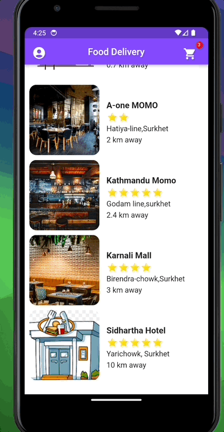

# Food Delivery App

A simple Flutter app for food delivery, built using the GetX state management library.

## Features
- Browse a variety of food items
- Place orders easily

## Technologies Used
- Flutter
- GetX State Management

## Demo

